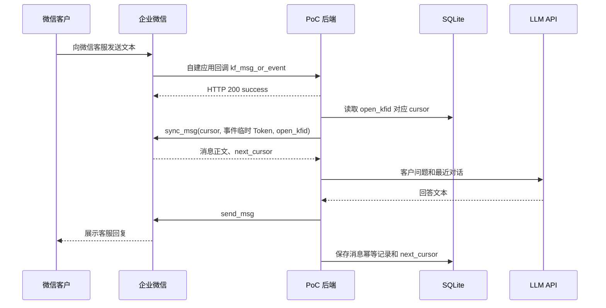
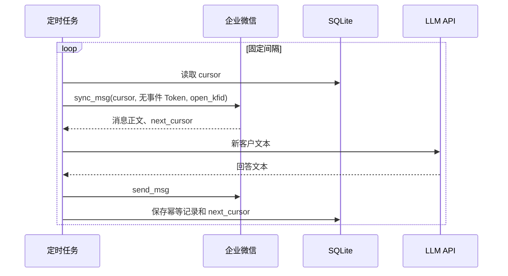

# 企业微信客服 LLM PoC 架构

## 1. 共同的数据链路

企业微信客服不会把客户消息正文直接交给 LLM 服务。无论采用事件驱动还是主动拉取，正文都通过 `kf/sync_msg` 获取，回复都通过 `kf/send_msg` 发送：

```text
kf/sync_msg -> 过滤客户文本 -> LLM -> kf/send_msg
```

两条路线的区别在于“何时调用 `sync_msg`”以及“是否携带回调事件中的临时 Token”，不是使用了两套不同的消息 API。

## 2. 路线 A：事件驱动拉取

这是当前 PoC 后端采用的路线，也是后续继续验证的首选路线。



配置入口位于自建应用，而不是微信客服页面：

```text
应用管理 -> 自建应用 -> Lprintf -> 接收消息 -> 设置 API 接收
```

必须勾选“微信客服消息和事件”。管理后台会强制同时启用“用户发送的普通消息”，且可能展示其他默认事件类型；“普通消息”指成员向自建应用发送的应用消息，不是微信客服客户消息。回调入口会对所有签名和 CorpID 合法的非微信客服事件返回 HTTP 200，但不记录正文，也不会调用 `sync_msg` 或 LLM。

事件回调只表示“有新消息或事件”，正文仍需调用 `sync_msg` 拉取。事件中的 `Token` 由企业微信生成、10 分钟内有效；携带它调用 `sync_msg` 可以避免无 Token 调用受到的严格频率限制。

优点：延迟低、无空轮询、能使用事件临时 Token。代价：需要公网 HTTPS、回调验签解密以及重复事件/消息幂等处理。

## 3. 路线 B：主动轮询拉取

此前 `backend/scripts/test_wechat_kf_api.py` 的烟测属于这条路线的一次性手动调用：不等待回调，直接使用持久化 cursor 调用 `sync_msg`。



官方允许省略 `sync_msg.token`，但明确说明此时接口有严格的频率限制。轮询间隔过短容易触发限流，过长则增加回答延迟；进程退出期间还必须保证在消息仅保留最近 3 天的窗口内恢复。

优点：不依赖公网回调，部署和排障简单。代价：存在空请求、限流和延迟权衡，且需要独立常驻调度器。当前仓库只有手动烟测脚本，没有实现自动轮询 worker。

## 4. 路线对比与选择

| 对比项 | 路线 A：事件驱动 | 路线 B：主动轮询 |
| --- | --- | --- |
| 触发来源 | `kf_msg_or_event` | 本地定时器 |
| 消息正文 | `sync_msg` | `sync_msg` |
| `sync_msg.token` | 使用事件中的 10 分钟临时 Token | 不传 |
| 公网回调 | 必需 | 不需要 |
| 频率限制 | 使用事件 Token，限制相对宽松 | 官方明确为严格限制 |
| 典型延迟 | 低 | 取决于轮询间隔 |
| 当前实现 | 完整后端已实现 | 只有手动 API 烟测 |
| PoC 用途 | 端到端首选 | 回调不可用时的备选 |

当前决策：路线 A 已通过真实消息验证，服务端成功完成一次 `sync_msg -> LLM -> send_msg`，且没有产生重复消息记录；下一步确认微信客户端展示并执行多轮、重启测试。保留路线 B 的烟测脚本作为 API 权限和故障排查工具，不同时启动自动轮询，避免两个消费者竞争同一个 cursor。

## 5. 凭证与状态生命周期

| 数据 | 生命周期 | 存储方式 |
| --- | --- | --- |
| `APP_AGENT_SECRET` | 长期，直到后台轮换 | 本地 secret 配置，不提交 Git |
| `LLM_API_KEY` | 长期，直到供应商轮换 | 本地 secret 配置，不提交 Git |
| 回调 Token | 长期，必须与自建应用回调页一致 | 本地 secret 配置，不提交 Git |
| EncodingAESKey | 长期，必须与自建应用回调页一致 | 本地 secret 配置，不提交 Git；修改后重建容器 |
| `access_token` | 短期 | 仅内存缓存 |
| 回调事件 `Token` | 10 分钟 | 仅在本次事件处理期间保存在内存 |
| `cursor` | 持久状态 | SQLite，按 `open_kfid` 保存 |
| 消息 ID | 持久幂等键 | SQLite 唯一键 |

`.env` 与单独 secret 文件只是配置组织方式；真正的安全边界还取决于文件权限、部署平台 secret 管理和日志脱敏。PoC 不应把任何密钥、完整 access token、事件 Token 或客户标识写入文档和日志。
