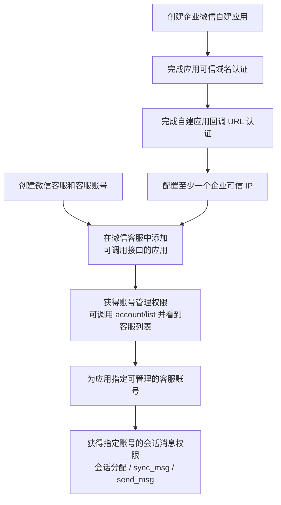
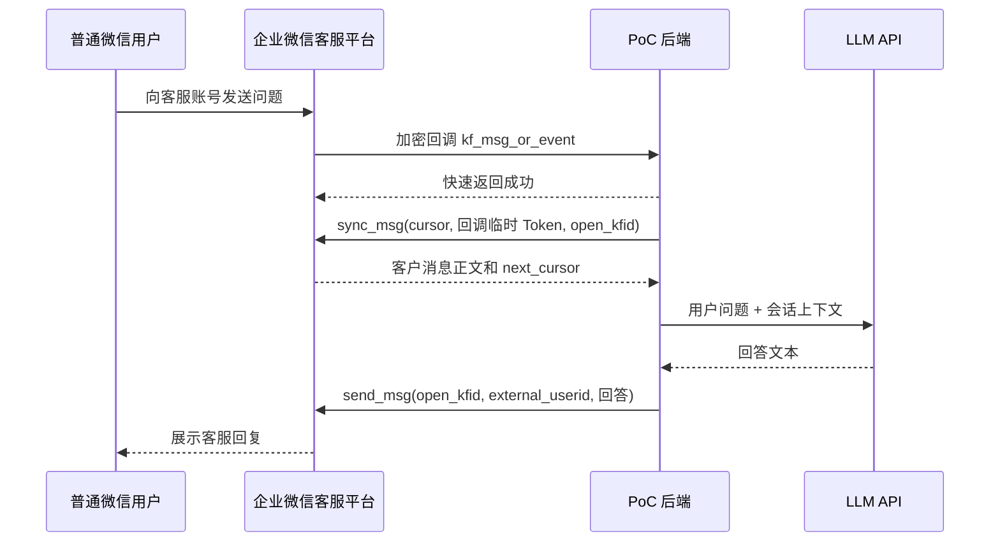

# 企业微信客服 API 配置与验证

本文记录本项目采用的“企业微信接管微信客服 / 企业内部开发”模式。目标是让企业自建应用通过 API 管理指定客服账号，并由后端读取和回复普通微信用户的消息。

## 1. 已验证配置

截至 2026-08-25，以下链路已通过真实企业微信环境验证：

- 自建应用：`Lprintf`（AgentID `1000002`）
- 可管理客服账号：`lprintf客服 @lprintf`
- `CorpID + APP_AGENT_SECRET` 可以获取 `access_token`
- 自建应用可以调用 `kf/account/list`
- 自建应用可以调用 `kf/sync_msg` 读取客户消息
- 自建应用可以调用 `kf/send_msg` 回复文本消息
- 普通微信端已实际收到测试回复 `test`
- OpenAI 兼容 LLM API 烟测成功
- 公网入口 `https://wc-dev.lprintf.com` 已上线，健康检查和可信域名认证文件均返回 HTTP 200
- 回调、SQLite cursor/幂等、LLM 调用和自动回复后端已部署
- 真实 `kf_msg_or_event` 已成功触发 `sync_msg -> LLM -> send_msg`，服务端只记录一条唯一消息

自建应用“接收消息服务器”已保存并通过 URL 验证。尚待确认微信客户端只显示一次回复，并继续执行多轮和重启验收。事件驱动与主动轮询两条路线的区别见 [ARCHITECTURE.md](./ARCHITECTURE.md)。

Secret、完整 `open_kfid`、客户 ID、access token 和消息 cursor 不应写入文档或日志。

## 2. 授权关系

本模式需要自建应用，但不需要第三方服务商应用，也不使用群机器人凭证。



其中包含两层不同的微信客服 API 权限：

1. **账号管理权限**：将已配置至少一个可信 IP 的自建应用添加到“可调用接口的应用”后，应用可以调用客服账号管理接口，`kf/account/list` 可以看到客服列表。
2. **会话消息权限**：还要为该应用指定可管理的客服账号，应用才可以对这些账号调用会话分配、`kf/sync_msg` 和 `kf/send_msg` 等会话消息接口。

因此，“能获取 access token”“能看到客服列表”和“能收发指定客服账号的消息”是三个不同的验证阶段。应用可见范围不是上述授权主链路的一环；只有接口返回 `60030` 等相关错误时，再检查客服接待人员是否位于应用可见范围内。

## 3. 后台配置步骤

### 3.1 创建微信客服和客服账号

在企业微信管理后台启用“微信客服”，创建 PoC 使用的客服账号，并准备客服链接或二维码供普通微信用户进入会话。本次验证使用 `lprintf客服 @lprintf`。

创建微信客服和创建自建应用都是后续 API 授权的前提，两者没有“客服账号自行接入 LLM”的关系。实际调用方是自建应用对应的 PoC 后端。

### 3.2 创建自建应用

进入企业微信管理后台，创建或选择用于 PoC 的自建应用。本项目使用 `Lprintf`。

记录以下信息到仓库根目录 `.env`：

```dotenv
CorpID=
APP_AGENT_ID=
APP_AGENT_SECRET=
```

- `CorpID`：企业 ID。
- `APP_AGENT_ID`：自建应用 AgentID，用于标识被授权应用。
- `APP_AGENT_SECRET`：自建应用 Secret，与 `CorpID` 一起获取 `access_token`。

不要使用群机器人 `BOT_SECRET`，也不要使用系统应用 Secret。

### 3.3 完成应用可信域名认证

按照企业微信后台要求下载域名验证文件。本项目的验证文件为：

```text
nginx/static/WW_verify_wVpUiYfAUwoEd9II.txt
```

项目通过 [docker-compose.yml](../docker-compose.yml) 将该文件只读挂载到 Nginx 站点根目录。认证时必须可以通过以下地址直接访问，响应内容不能被修改：

```text
https://<可信域名>/WW_verify_wVpUiYfAUwoEd9II.txt
```

本地检查：

```powershell
docker compose up -d gateway
Invoke-WebRequest http://127.0.0.1:8060/WW_verify_wVpUiYfAUwoEd9II.txt
```

域名认证与企业可信 IP 是两项不同配置。域名认证成功不代表服务端 API 已允许当前出口 IP。

### 3.4 配置自建应用接收消息服务器

进入自建应用 `Lprintf`，在“接收消息”中点击“设置 API 接收”，填写回调 URL、Token 和 EncodingAESKey，并通过后台的 URL 有效性校验。微信客服本身没有第二个独立的回调配置入口；同一个自建应用回调负责接收所勾选的事件。

必须勾选“微信客服消息和事件”。管理后台强制启用的“用户发送的普通消息”无法取消，它指成员向自建应用发送的应用消息，不是微信客服客户消息。后端会验签解密所有回调，但只处理 `kf_msg_or_event`；其他合法事件直接返回 HTTP 200，不保存正文、不调用 LLM。

### 3.5 配置企业可信 IP

完成可信域名和自建应用回调 URL 认证后，将运行后端的公网出口 IP 加入自建应用的企业可信 IP。至少配置一个可信 IP 后，才能在微信客服中将该应用添加为“可调用接口的应用”。

注意：开发电脑的公网出口 IP 可能变化。可信 IP 配置的是外部服务看到的公网 IP，不是 `127.0.0.1`、局域网 IP 或 Docker 容器 IP。生产环境应使用固定公网出口 IP。

### 3.6 添加可调用接口的应用

进入：

```text
企业微信管理后台
  -> 应用管理
  -> 微信客服
  -> API
  -> 可调用接口的应用
```

选择自建应用 `Lprintf` 并保存。

完成此步后，自建应用获得微信客服账号管理权限，可以调用 `kf/account/list` 并看到客服列表，但此时还不能据此认定 `sync_msg` 或 `send_msg` 已获授权。

### 3.7 指定通过 API 管理的客服账号

进入：

```text
企业微信管理后台
  -> 应用管理
  -> 微信客服
  -> API
  -> 通过 API 管理会话消息
  -> 企业内部开发
```

为自建应用 `Lprintf` 选择需要管理的客服账号。本次验证使用 `lprintf客服 @lprintf`。

配置完成后，该应用才有权限调用该客服账号的会话分配、`sync_msg` 和 `send_msg`。仅把应用加入“可调用接口的应用”还不够。

切换为 API 管理后，程序需要及时拉取和回复消息；原生接待规则可能不再生效。

### 3.8 按错误信息检查应用可见范围

应用可见范围不属于上述核心授权顺序。如果接口返回 `60030`，再确认客服账号对应的接待人员是否位于自建应用 `Lprintf` 的可见范围内。

## 4. API 验证

测试脚本位于：

```text
backend/scripts/test_wechat_kf_api.py
```

默认只读，依次验证获取凭证、列出客服账号和读取消息：

```powershell
cd backend
uv run python scripts/test_wechat_kf_api.py
```

向最近一位发过消息的客户回复 `test`：

```powershell
uv run python scripts/test_wechat_kf_api.py --send-test
```

发送任意测试内容：

```powershell
uv run python scripts/test_wechat_kf_api.py --send-test --content "测试回复"
```

列出最近客户的昵称、完整企业微信客户 ID、性别及最后消息时间（UTC）：

```powershell
uv run python scripts/test_wechat_kf_api.py --list-customers
```

列表按客户去重、最近消息优先，只包含本次 `sync_msg` 拉取到的客户（默认最近三天），不是全部历史客户。资料接口失败时仍输出客户 ID 和时间，并打印错误码。这里的 `external_userid` 是企业微信客户 ID，不是后台内部的数字用户 ID。

要查看更早的客户，使用 `--database` 读取后端保存的全部历史客户（在 `backend` 目录运行）：

```powershell
uv run python scripts/test_wechat_kf_api.py --list-customers --database "data/wechat_bot.db"
```

该模式只读 SQLite，不请求企业微信、不需要 API 配置，显示后台数字用户 ID、完整客服账号 ID、完整客户 ID、缓存昵称、性别和最近活跃时间。默认列出数据库中所有客服账号的客户，可用 `--open-kfid` 筛选。客户资料是后端保存的缓存；数据库中尚未保存的客户无法列出。`--database` 不能与 `--send-test` 同用，请复制目标 ID 后单独执行发送测试。

Compose 部署的数据库位于容器的 `/app/data/wechat_bot.db`（若配置了 `DATABASE_PATH`，以配置为准），不是本机的 `backend/data`。使用[开发覆盖配置](COMPOSE_DEV.md)挂载脚本后，从项目根目录运行：

```powershell
docker compose -f docker-compose.yml -f compose.dev.yaml up -d --build
docker compose exec -T backend python scripts/test_wechat_kf_api.py --list-customers --database data/wechat_bot.db
```

相对路径兼容 Git Bash，避免 `/app/...` 被自动转换成 Windows 路径。`--max-pages` 只控制最近三天消息的分页上限，无法扩大企业微信的历史保留时间。

复制列表中的 `external_userid` 来指定测试对象：

```powershell
uv run python scripts/test_wechat_kf_api.py --send-test --external-userid "wm完整客户ID" --content "测试回复"
```

指定目标发送时直接调用 `kf/send_msg`，不依赖最近消息列表，也不经过后端本地额度检查。失败会打印真实 `errcode` 和 `errmsg`；成功会真实发送消息、消耗一次额度，且不会更新后端的本地发送计数。

脚本行为：

- 自动读取仓库根目录 `.env`。
- 如果只有一个可见客服账号，自动使用该账号。
- 如果有多个账号，必须设置 `WECHAT_KF_OPEN_KFID` 或传入 `--open-kfid`。
- 不输出 Secret 或 access token；显式使用 `--list-customers` 时输出完整客户 ID，数据库模式还会输出完整客服账号 ID。
- 未指定 `--send-test` 时不会发送消息。

已验证的成功输出形态：

```text
config: ready (application AgentID=1000002)
gettoken: ok
kf/account/list: ok (1 account(s))
kf/sync_msg: ok (..., 1 customer message(s))
kf/send_msg: ok (msgid returned=True)
```

## 5. 消息处理流程

完整架构包含事件驱动和主动轮询两条路线，详见 [ARCHITECTURE.md](./ARCHITECTURE.md)。当前自动回答后端采用事件驱动路线；此前主动执行 `test_wechat_kf_api.py` 是不依赖回调的一次性拉取烟测。两条路线最终都通过 `sync_msg` 读取正文，通过 `send_msg` 回复。

回调事件不包含完整聊天正文。后端收到 `kf_msg_or_event` 后，使用事件中的临时 Token 调用 `sync_msg`，再把处理结果通过 `send_msg` 发给客户。



需要区分两个 Token：

- `WECHAT_KF_CALLBACK_TOKEN`：配置接收消息服务器时自定义，用于校验回调签名。
- 回调 XML 中的 `Token`：企微生成、短期有效，传给 `sync_msg` 以降低拉取频率限制。

## 6. 自建应用接收消息配置

回调后端和自动回答链路已经实现并部署。进入“应用管理 -> 自建应用 -> Lprintf -> 接收消息 -> 设置 API 接收”。本地配置与后台必须使用完全相同的 Token 和 EncodingAESKey：

```dotenv
WECHAT_KF_CALLBACK_TOKEN=
WECHAT_KF_ENCODING_AES_KEY=
PUBLIC_BASE_URL=
```

填写的回调地址：

```text
https://wc-dev.lprintf.com/wecom/kf/callback
```

配置以下两项，并确认“微信客服消息和事件”已勾选；“用户发送的普通消息”作为必选项保留：

- Token：`WECHAT_KF_CALLBACK_TOKEN`
- EncodingAESKey：`WECHAT_KF_ENCODING_AES_KEY`

保存时，企业微信会向该 URL 发起带 `msg_signature`、`timestamp`、`nonce` 和 `echostr` 的 GET 请求。后端校验签名并解密成功后，后台才会允许保存。直接在浏览器访问回调 URL 返回 `422` 是正常的，因为普通请求缺少这些参数。

EncodingAESKey 必须是 43 位英文或数字。修改本地值后必须重建 backend 容器，否则运行中的进程仍使用旧密钥，URL 验证会返回 HTTP 403。

保存成功后：

1. 普通微信用户向 `lprintf客服 @lprintf` 发送一条新的文本问题。
2. 企业微信向后端 POST `kf_msg_or_event`。
3. 后端异步执行 `sync_msg -> LLM -> send_msg`。
4. 确认微信端只收到一次模型回复，并检查后端日志没有密钥或完整客户标识。

## 6.1 LLM API 烟测

后端已提供 OpenAI 兼容的非流式 Chat Completions 客户端。它读取仓库根目录 `.env` 中的 `LLM_API_KEY`、`LLM_BASE_URL` 和 `LLM_MODEL`，不会访问企业微信，也不会向客户发送消息。

```powershell
cd backend
uv sync
uv run python scripts/test_llm_api.py
```

`LLM_BASE_URL` 可以填写版本根地址（例如 `https://example.com/v1`），客户端会请求其 `/chat/completions`；也可以直接填写完整的 `/chat/completions` 地址。真实接入前应先确认该命令返回 `chat/completions: ok`。

## 7. 常见错误

| 错误码 | 含义 | 处理方式 |
| --- | --- | --- |
| `60020` | 当前公网出口 IP 不可信 | 将错误信息中的 `from ip` 加入自建应用企业可信 IP |
| `48002` | API 或客服账号权限不足 | 授权自建应用，并把目标客服账号配置为通过该应用 API 管理 |
| `60030` | 接待人员不在应用可见范围 | 将相关接待人员加入自建应用可见范围 |

官方参考：

- [微信客服概述](https://developer.work.weixin.qq.com/document/path/94638)
- [接收消息和事件](https://developer.work.weixin.qq.com/document/path/94670)
- [发送消息](https://developer.work.weixin.qq.com/document/path/94677)
