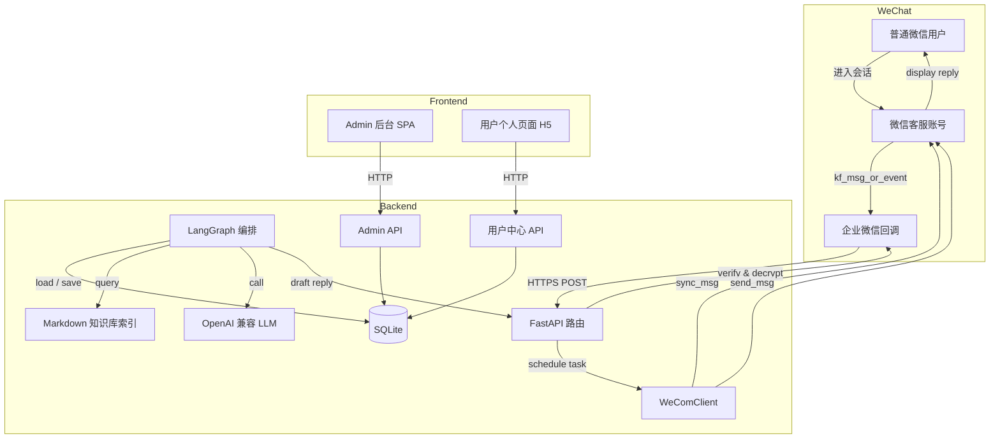
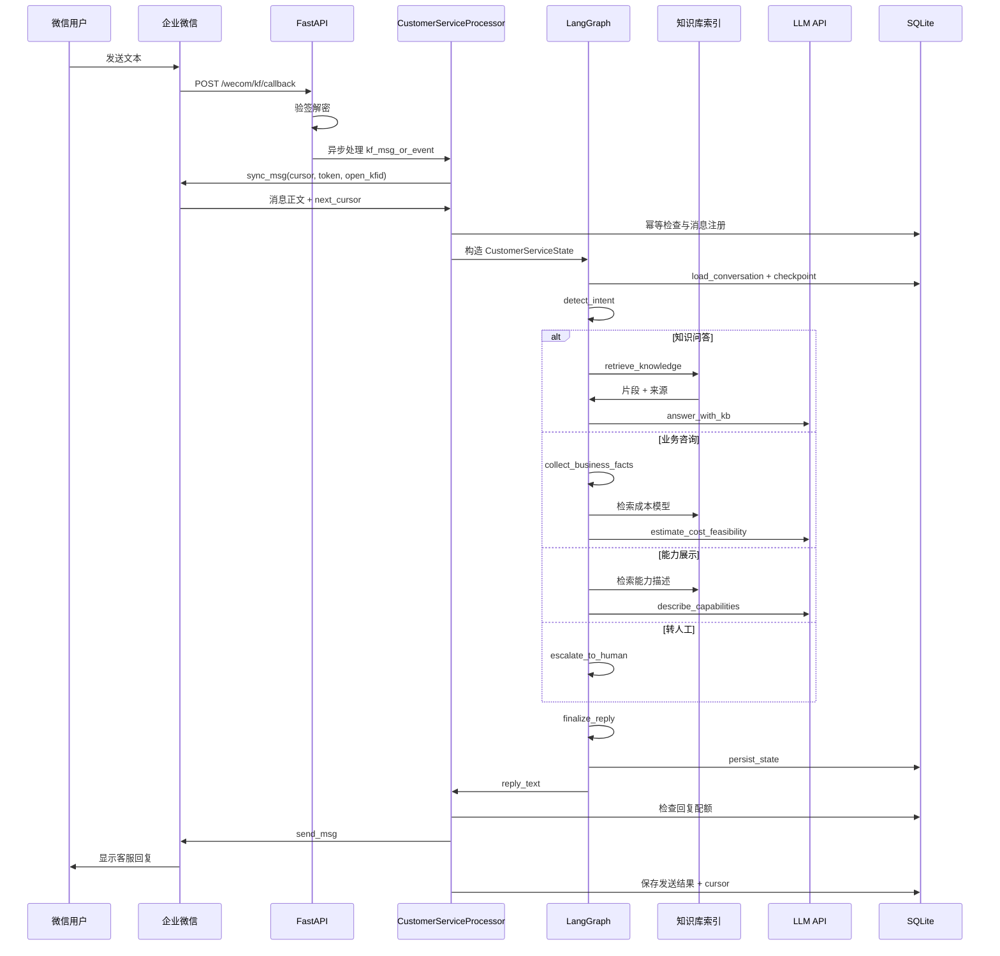
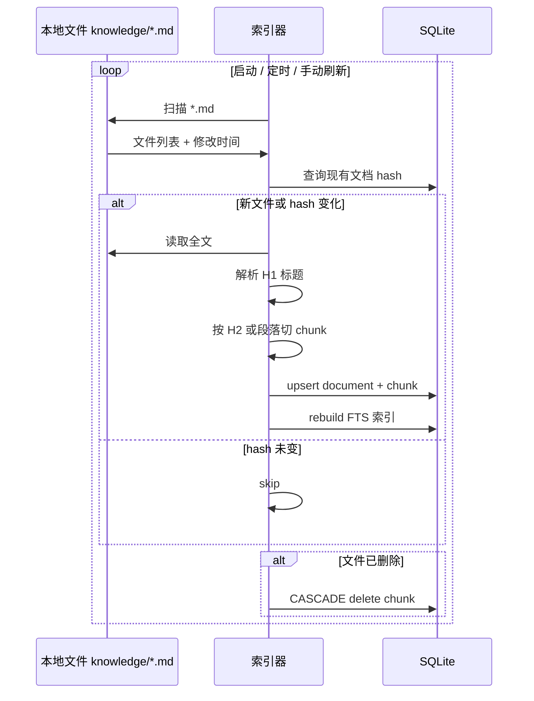

# 系统架构与数据模型

## 1. 总体架构



## 2. 消息处理链路

延续现有事件驱动路线（路线 A），在 LLM 调用前插入 LangGraph 编排：



## 3. 数据模型

### 3.1 现有表（保持不动）

```text
app_user
user_identity
customer_profile
login_ticket
web_session
kf_cursor
processed_message
reply_quota
conversation
conversation_message
admin_user_state
```

这些表继续作为业务事实来源，不因引入 LangGraph 而迁移或重构字段。

### 3.2 新增表

```text
knowledge_document
    id          INTEGER PRIMARY KEY
    path        TEXT NOT NULL UNIQUE    -- 相对路径 knowledge/xxx.md
    title       TEXT NOT NULL           -- 从第一个 H1 提取
    content_hash TEXT NOT NULL          -- 用于增量更新
    updated_at  INTEGER NOT NULL

knowledge_chunk
    id          INTEGER PRIMARY KEY
    document_id INTEGER NOT NULL REFERENCES knowledge_document(id) ON DELETE CASCADE
    heading     TEXT                    -- 所属标题（可能为空）
    content     TEXT NOT NULL           -- 片段正文
    ordinal     INTEGER NOT NULL

-- 索引：在 document_id, heading, content 上建 FTS5 虚拟表用于关键词检索
knowledge_chunk_fts
    content     TEXT

conversation_summary
    user_id             INTEGER NOT NULL REFERENCES app_user(id) ON DELETE CASCADE
    conversation_id     INTEGER NOT NULL REFERENCES conversation(id) ON DELETE CASCADE
    intent              TEXT
    scenario            TEXT
    discovery_step      INTEGER
    business_facts_json TEXT
    estimate_json       TEXT
    lead_interest       TEXT            -- cold / warm / hot
    updated_at          INTEGER NOT NULL
    PRIMARY KEY (user_id, conversation_id)

knowledge_ref
    message_id  INTEGER NOT NULL REFERENCES conversation_message(id) ON DELETE CASCADE
    document_id INTEGER NOT NULL REFERENCES knowledge_document(id)
    chunk_id    INTEGER NOT NULL REFERENCES knowledge_chunk(id)
    heading     TEXT
```

- `conversation_summary`：LangGraph 业务摘要的冗余副本，供 Admin 和用户个人页面直接查询，不依赖 LangGraph 内部表结构。
- `knowledge_ref`：关联对话消息与知识来源，支持 Admin 来源审计和前端展示。

### 3.3 LangGraph checkpoint 表

由 LangGraph SQLite checkpoint saver 自行管理，与业务表共享同一 SQLite 文件，但使用独立连接或写入事务避免锁竞争。

## 4. 知识库索引生命周期



索引器在应用启动时运行一次增量扫描，之后可添加 `/admin/knowledge/reindex` 手动触发。

## 5. 回复策略与保护

当前 `replies.py` 的回复配额、幂等和发送逻辑保持不变。LangGraph 只生成 `reply_text`，实际发送仍经过：

```text
reply_text -> send_reply(wecom, store, open_kfid, external_userid, content)
           -> reply_lock(open_kfid)
           -> reply_budget.footer()
           -> wecom.send_text(...)
           -> store.consume_reply(...)
```

引入 LangGraph 后需增加的检查：

- LangGraph 生成的回复不得包含已有 footer；footer 仍由 `send_reply` 追加。
- 业务咨询中也许发系统消息（如“已为你记录”）；这类消息同样需要走配额检查。
- 如果回复策略处于 `suggest_only` 或 `human_only`（来自人工接管），LangGraph 生成的 `reply_text` 只作为建议记录到 Admin，不调用 `send_reply`。

## 6. 依赖

在现有 `cryptography`、`fastapi`、`httpx`、`uvicorn` 之外新增：

```text
langgraph
langgraph-checkpoint-sqlite
```

知识库检索和 Markdown 解析暂不新增依赖；使用 Python 标准库 `re` 和 `pathlib` 即可完成关键词匹配和标题切分。

## 7. 目录结构

```text
backend/
  wechat_bot/
    app.py            # FastAPI 路由（不变）
    callback.py       # 回调解析（不变）
    config.py         # 配置加载（新增知识库目录、意图分类阈值）
    crypto.py         # 加解密（不变）
    llm.py            # LLM 客户端（不变，LangGraph 作为上层调用者）
    replies.py        # 回复配额与发送（不变）
    service.py        # 客服处理编排（重构，委托给 LangGraph）
    store.py          # SQLite 仓储（新增知识库、摘要表操作）
    web.py            # 用户中心渲染（新增演示摘要卡片）
    wecom.py          # 企业微信客户端（不变）
  knowledge/
    capabilities.md
    scenarios.md
    pricing.md
    implementation.md
    faq.md
  graph/
    __init__.py
    state.py          # CustomerServiceState
    intents.py        # 意图枚举与检测
    nodes.py          # 所有节点实现
    routes.py         # 条件边
    graph.py          # 图构建
    knowledge.py      # 知识库索引与检索
  tests/
    test_graph.py
    test_knowledge.py
    test_intents.py
    # 既有测试不动
```

