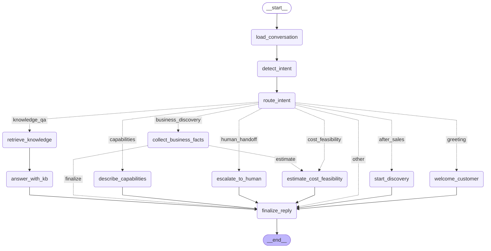

```mermaid
---
config:
  flowchart:
    curve: linear
---
graph TD;
	__start__([<p>__start__</p>]):::first
	load_conversation(load_conversation)
	detect_intent(detect_intent)
	route_intent(route_intent)
	welcome_customer(welcome_customer)
	describe_capabilities(describe_capabilities)
	retrieve_knowledge(retrieve_knowledge)
	answer_with_kb(answer_with_kb)
	start_discovery(start_discovery)
	collect_business_facts(collect_business_facts)
	estimate_cost_feasibility(estimate_cost_feasibility)
	escalate_to_human(escalate_to_human)
	finalize_reply(finalize_reply)
	__end__([<p>__end__</p>]):::last
	__start__ --> load_conversation;
	answer_with_kb --> finalize_reply;
	collect_business_facts -. &nbsp;estimate&nbsp; .-> estimate_cost_feasibility;
	collect_business_facts -. &nbsp;finalize&nbsp; .-> finalize_reply;
	describe_capabilities --> finalize_reply;
	detect_intent --> route_intent;
	escalate_to_human --> finalize_reply;
	estimate_cost_feasibility --> finalize_reply;
	load_conversation --> detect_intent;
	retrieve_knowledge --> answer_with_kb;
	route_intent -. &nbsp;business_discovery&nbsp; .-> collect_business_facts;
	route_intent -. &nbsp;capabilities&nbsp; .-> describe_capabilities;
	route_intent -. &nbsp;human_handoff&nbsp; .-> escalate_to_human;
	route_intent -. &nbsp;cost_feasibility&nbsp; .-> estimate_cost_feasibility;
	route_intent -. &nbsp;other&nbsp; .-> finalize_reply;
	route_intent -. &nbsp;knowledge_qa&nbsp; .-> retrieve_knowledge;
	route_intent -. &nbsp;after_sales&nbsp; .-> start_discovery;
	route_intent -. &nbsp;greeting&nbsp; .-> welcome_customer;
	start_discovery --> finalize_reply;
	welcome_customer --> finalize_reply;
	finalize_reply --> __end__;
	classDef default fill:#f2f0ff,line-height:1.2
	classDef first fill-opacity:0
	classDef last fill:#bfb6fc

```