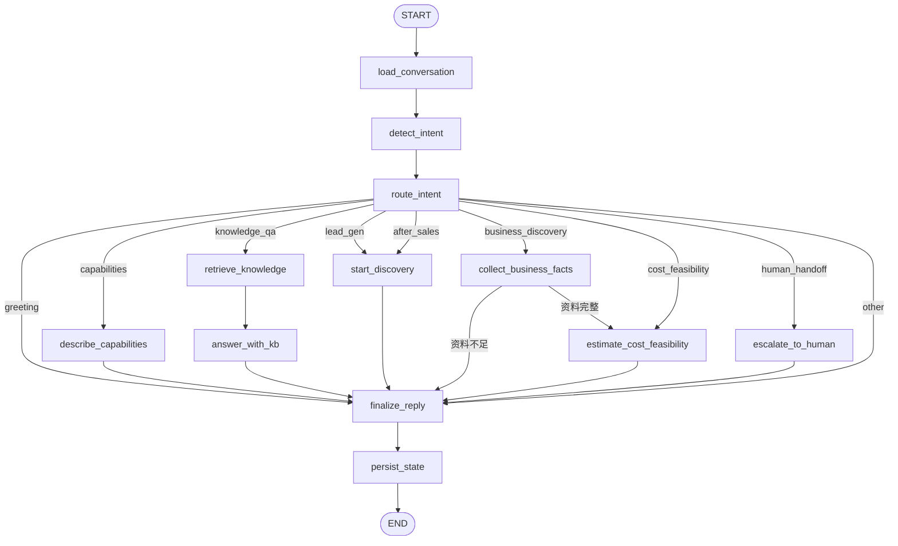
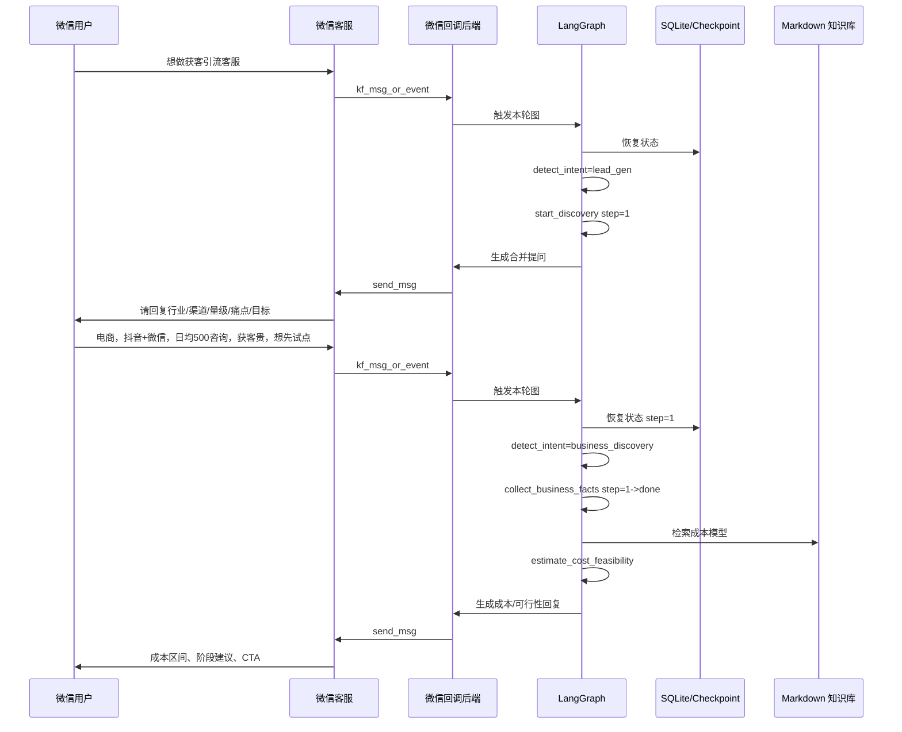

# LangGraph 对话编排设计

本文定义 AI 客服展示助手的 LangGraph 状态模型、节点、边和持久化策略。LangGraph 只负责对话编排，消息发送仍走现有 `send_reply` 配额和幂等门。

## 1. 状态模型

```python
class CustomerServiceState(TypedDict, total=False):
    user_id: int
    conversation_id: int
    open_kfid: str
    external_userid: str

    incoming_messages: list[dict]
    history: list[dict]

    intent: str
    scenario: str

    knowledge_chunks: list[dict]
    discovery_step: int
    business_facts: dict
    estimate: dict | None

    reply_text: str
    error: str | None
```

字段说明：

- `user_id`、`conversation_id`：内部用户和会话主键，作为 checkpoint thread id 的组成。
- `open_kfid`、`external_userid`：微信客服账号和客户标识，只在内部使用，不写入回复正文。
- `incoming_messages`：本轮拉取到并待处理的客户消息，按时间排序。
- `history`：最近 N 条已保存的客户/AI/人工消息，供意图识别和回答使用。
- `intent`：当前识别出的意图。
- `scenario`：业务场景，`lead_gen` 或 `after_sales`。
- `knowledge_chunks`：知识库检索返回的片段和来源。
- `discovery_step`：业务咨询当前阶段。
- `business_facts`：已收集的行业、渠道、量级、痛点、目标和现有系统。
- `estimate`：成本与技术可行性分析结果。
- `reply_text`：最终待发送回复。
- `error`：流程错误或阻断原因。

## 2. 意图枚举

```text
greeting
capabilities
knowledge_qa
lead_gen
after_sales
business_discovery
cost_feasibility
human_handoff
profile
other
```

意图识别遵循“系统命令确定性路由，业务意图交给 LLM”：

- 仅 `profile` 走硬编码：`个人中心`、`我的信息`、`我的消息`、`查看记录`。
- 其他意图全部由 LLM 分类，不堆叠业务关键词，避免脆弱的规则匹配。
- 若存在未完成的 `discovery_step`，优先进入 `business_discovery`，不因单轮回答偏离主线。
- LLM 置信度不足时进入 `other`，先澄清，不强行生成业务结论。


## 3. 节点说明

### 3.1 `load_conversation`

- 从 SQLite 加载用户、会话和最近历史消息。
- 从 LangGraph checkpoint 加载上一轮状态。
- 将本轮新消息合并进 `incoming_messages`。

### 3.2 `detect_intent`

- 先判断是否命中 `profile` 系统命令；否则交给 LLM 分类器识别意图。
- 输出 `intent` 和 `scenario`。

### 3.3 `route_intent`

- 根据 `intent` 走条件边。
- 不直接执行外部副作用。

### 3.4 `retrieve_knowledge`

- 查询 Markdown 知识库索引。
- 返回 top 片段、标题、章节、路径和分数。

### 3.5 `answer_with_kb`

- 基于 `knowledge_chunks` 生成回答。
- 无可靠命中时输出“暂未在知识库中找到对应内容”，并给出换问建议。

### 3.6 `describe_capabilities`

- 从能力知识库中取获客引流、售后客服、知识问答等介绍。
- 每项能力后接一个追问，推动业务咨询。

### 3.7 `start_discovery`

- 初始化 `scenario` 和 `discovery_step=1`。
- 生成第一条合并提问。

### 3.8 `collect_business_facts`

- 从用户回复中提取行业、渠道、量级、痛点、目标和现有系统。
- 更新 `business_facts` 和 `discovery_step`。
- 字段不足时继续追问，字段齐全时进入成本评估。

### 3.9 `estimate_cost_feasibility`

- 结合知识库定价模型和 `business_facts` 生成：
  - 建议方案。
  - 成本区间。
  - 技术可行性。
  - 风险。
  - 分阶段落地建议。
  - 下一步动作。
- 输出必须标注 Demo 估算。

### 3.10 `escalate_to_human`

- 生成转人工/商务 CTA。
- 在 Admin 后台标记跟进状态。

### 3.11 `finalize_reply`

- 截断到微信文本长度限制。
- 检查敏感内容。
- 追加 footer。
- 输出最终 `reply_text`。

### 3.12 `persist_state`

- 写入 LangGraph checkpoint。
- 将意图、知识来源、业务事实和评估结果同步到 SQLite 业务摘要表。

## 4. 图结构



## 5. 多轮业务咨询时序

下面展示普通微信用户进入获客引流咨询后的跨轮次状态迁移。每一轮微信回调触发一次 LangGraph 执行，状态从 checkpoint 恢复并在结束前写回。



## 6. 持久化策略

- LangGraph 使用 SQLite checkpoint saver。
- thread id 使用 `user_id:{user_id}:conversation:{conversation_id}`。
- 每个节点输出不可变地追加到 checkpoint，不修改历史状态。
- 发送消息前重新检查回复策略和额度；即使 checkpoint 已存在，也不能依赖旧额度值。
- 业务流程摘要同步到独立业务表，方便 Admin 和用户个人页面查询，不直接读取 LangGraph 内部表。

## 7. 错误与重试

- 意图识别失败：回退为 `other`，发送澄清消息。
- 知识库不可用：回退为通用能力介绍或转人工，不返回空知识片段。
- 成本模型缺失输入：继续追问缺失字段，不强行估算。
- 微信发送失败：复用现有错误处理和额度更新逻辑，不回滚已经写入的客户消息事实。
- 重复回调：消息幂等仍由现有 `processed_message` 保证；LangGraph 不得重复消费同一批消息。

## 8. 可观测性

- 每轮记录：`user_id`、`intent`、`discovery_step`、知识来源、节点路径、耗时和错误码。
- 不记录：客户消息原文中的敏感信息、密钥、access token、完整个人资料。
- 指标：意图分布、知识命中率、业务咨询完成率、转人工率、平均输入/输出 token。
