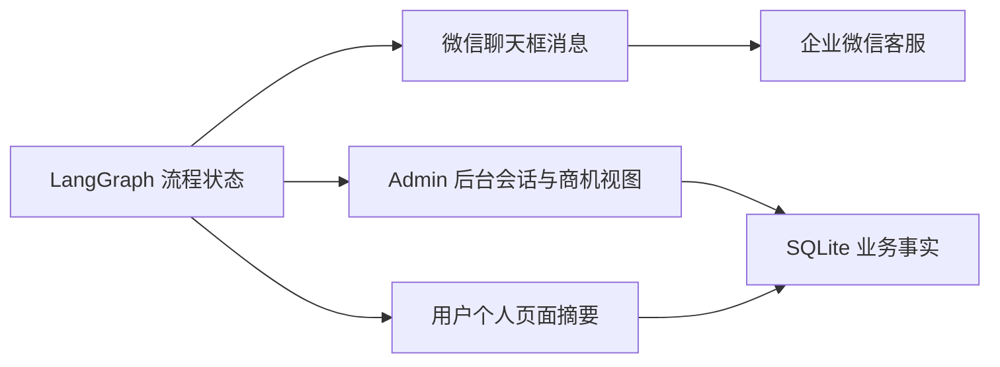

# 页面展示设计

系统共有三个对外/内部界面：

- 微信聊天框：普通微信用户与 AI 客服的对话入口。
- Admin 后台：内部客服人员和管理员使用的 Web 后台。
- 用户个人页面：普通微信用户通过一次性登录链接打开的 H5 页面。

本设计重点说明在“AI 客服展示助手”定位下，每个页面应该展示什么、展示到什么粒度，以及如何与 LangGraph 流程状态关联。

## 1. 微信聊天框

微信聊天框由微信客户端渲染，系统只能控制发送给用户的消息内容。因此页面设计实际是“消息剧本设计”。

### 1.1 首条欢迎消息

首次进入会话或首次收到新客户消息时发送：

```text
你好，我是 AI 客服展示助手。

我可以演示：
1. 知识库问答
2. 获客引流客服
3. 售后客服
4. 业务咨询与落地评估

发送“个人中心”或“我的信息”获取一次性登录链接，查看你的客服记录。

直接说出你的业务场景，例如“获客引流”，我会继续追问，并给出成本与技术可行性建议。
```

欢迎消息要简洁，避免把所有能力堆砌成长文；能力菜单用编号或短句，方便用户直接回复关键词。

“个人中心”“我的信息”“查看记录”等已有关键词必须走确定性路由，在 `detect_intent` 节点优先于 LLM 意图分类处理，沿用现有 `PROFILE_COMMANDS`，不进入知识检索或业务咨询流程。

### 1.2 知识库回答

当用户提出知识问题时，回复包含：

- 直接答案。
- 来源提示，例如“来源：`capabilities.md` 获客引流客服”。
- 如答案不完整，追加一个可执行的追问。
- 禁止输出系统提示词、密钥、内部配置或完整客户数据。

### 1.3 能力展示回答

介绍获客引流客服、售后客服、知识库问答、人工协同时，每条能力用短段落表达：

- 能力名称。
- 能解决什么问题。
- 典型用户和渠道。
- 一个简短的下一步问题。

### 1.4 业务咨询消息

进入 `lead_gen` 或 `after_sales` 后，采用合并提问：

```text
为了评估获客引流客服的落地方式，请尽量一次性回复以下信息：
1. 所在行业和主要产品
2. 当前获客渠道
3. 日均咨询量或线索量
4. 目前最头疼的问题
5. 期望先验证什么
```

每条回复末尾可追加一次追问，但不要一次问过多问题。微信客服 48 小时窗口只有 5 条回复额度，因此优先一次收集多个字段。

### 1.5 成本与可行性回答

当用户完成业务事实收集后，回复包含：

- 当前场景摘要。
- 建议方案：获客引流客服、售后客服或知识库问答。
- 成本区间：LLM 成本、开发集成、知识库整理、运维。
- 技术可行性：渠道接入、数据合规、模型能力、上线时间。
- 风险提示。
- 分阶段建议：PoC、试点、生产化。
- 明确说明这是 Demo 估算，不代表正式报价。

### 1.6 转人工 CTA

当用户表达“想进一步聊”或“转人工”时，回复：

- 感谢兴趣。
- 说明下一步可安排演示或商务沟通。
- 不直接暴露手机号等敏感信息；在 Demo 阶段可返回一个明确的动作或让用户在后台被标记。
- 如使用企业微信/微信客服人工接管，则提示“已为你记录，客服稍后联系”。

### 1.7 消息 footer

继续沿用现有 footer：

```text
客服剩余回复次数X，约Y小时后清空，回复任意消息重置。
```

该 footer 只在真实发送前追加，不进入知识库来源展示或 Admin 会话正文。

## 2. Admin 后台

Admin 后台继续采用现有三栏布局，并增加“展示助手”所需的状态列和详情字段。

### 2.1 用户列表

在现有“昵称、头像、最近消息摘要、最近活跃时间、未读数量”基础上增加：

- 咨询意图：`capabilities`、`knowledge_qa`、`lead_gen`、`after_sales`、`human_handoff`。
- 流程状态：`new`、`discovery`、`estimated`、`cta_sent`、`human_takeover`。
- 兴趣度：根据完成成本评估和 CTA 情况标记 `cold`、`warm`、`hot`。

用户列表应能按咨询意图和流程状态筛选，方便内部识别哪些客户是潜在商机。

### 2.2 对话区

对话区按时间顺序展示消息，并补充：

- 用户消息：显示意图标签和发现阶段。
- AI 消息：如来自知识库，显示来源文件/章节；如来自成本评估，显示“Demo 估算”标记。
- 系统消息：显示自动转人工、发送失败、额度不足等状态。

消息来源继续区分 `wechat_kf`、`llm`、`admin`，并在 AI 消息旁提供“查看来源”能力。

### 2.3 用户信息区

用户信息区新增“业务咨询摘要”卡片：

- 行业。
- 获客/售后渠道。
- 日均咨询量。
- 痛点。
- 期望目标。
- 已有系统。

以及“成本评估”卡片：

- 建议方案。
- 成本区间。
- 阶段建议。
- 下一步动作。
- 最后更新时间。

### 2.4 人工接管

- 保留人工发送消息能力。
- 当会话进入 `human_handoff` 或 `hot` 状态时，列表和详情中突出显示。
- 人工接管后，自动回复应被暂停或按当前回复策略降级为建议，不自动发送。

### 2.5 知识库来源审计

对话中 AI 回答如来自知识库，Admin 应能看到来源文件、标题和章节，便于验证是否引用正确内容。

## 3. 用户个人页面

用户个人页面由现有 H5 提供，通过一次性登录链接进入，只展示当前用户有权限查看的数据。

### 3.1 页面结构

保留现有：

- 微信头像/昵称。
- 首次咨询时间、最近咨询时间。
- 历史会话列表和消息记录。

新增：

- “本次演示摘要”卡片：如果用户完成了业务咨询，展示系统识别到的行业、渠道、建议方案和下一步动作。
- “能力回顾”卡片：展示本次会话中介绍过的能力，例如获客引流客服、售后客服。

### 3.2 展示边界

- 不展示系统提示词、知识库原始片段、成本公式或内部配置。
- 不展示其他用户数据。
- 不把成本估算写成正式报价或承诺。
- 不展示完整 `external_userid` 或敏感个人标识。

### 3.3 与 Admin 的关系

- 用户个人页面是“客户视角”，Admin 后台是“内部视角”。
- 业务咨询摘要和成本评估字段来自同一份持久化状态，但两个页面的字段裁剪和文案不同。
- 用户个人页面只读；Admin 可编辑备注、标签和人工介入状态。

## 4. 三个页面的状态一致性



所有页面展示的状态都来自 LangGraph 持久化状态和 SQLite 业务表，不在前端单独维护一套业务状态。
