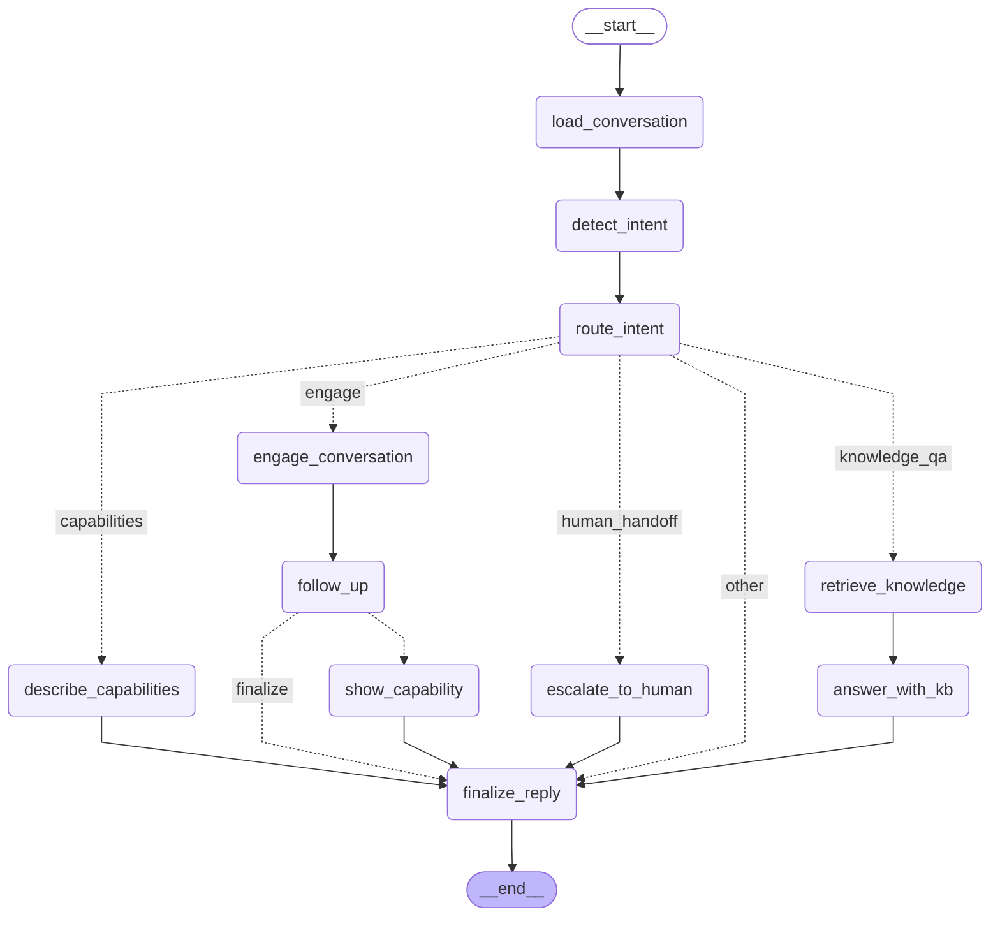

```mermaid
---
config:
  flowchart:
    curve: linear
---
graph TD;
	__start__([<p>__start__</p>]):::first
	load_conversation(load_conversation)
	detect_intent(detect_intent)
	route_intent(route_intent)
	describe_capabilities(describe_capabilities)
	retrieve_knowledge(retrieve_knowledge)
	answer_with_kb(answer_with_kb)
	engage_conversation(engage_conversation)
	follow_up(follow_up)
	show_capability(show_capability)
	escalate_to_human(escalate_to_human)
	finalize_reply(finalize_reply)
	__end__([<p>__end__</p>]):::last
	__start__ --> load_conversation;
	answer_with_kb --> finalize_reply;
	describe_capabilities --> finalize_reply;
	detect_intent --> route_intent;
	engage_conversation --> follow_up;
	escalate_to_human --> finalize_reply;
	follow_up -. &nbsp;finalize&nbsp; .-> finalize_reply;
	follow_up -.-> show_capability;
	load_conversation --> detect_intent;
	retrieve_knowledge --> answer_with_kb;
	route_intent -. &nbsp;capabilities&nbsp; .-> describe_capabilities;
	route_intent -. &nbsp;engage&nbsp; .-> engage_conversation;
	route_intent -. &nbsp;human_handoff&nbsp; .-> escalate_to_human;
	route_intent -. &nbsp;other&nbsp; .-> finalize_reply;
	route_intent -. &nbsp;knowledge_qa&nbsp; .-> retrieve_knowledge;
	show_capability --> finalize_reply;
	finalize_reply --> __end__;
	classDef default fill:#f2f0ff,line-height:1.2
	classDef first fill-opacity:0
	classDef last fill:#bfb6fc

```