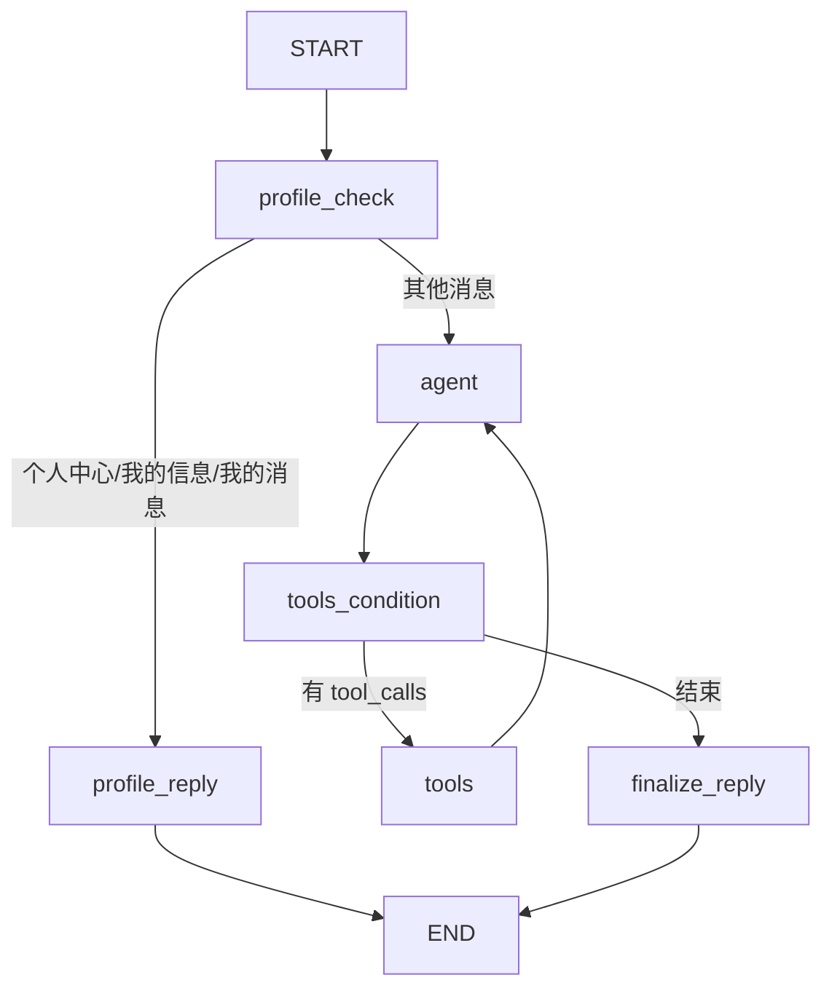

# LangGraph ReAct 架构决策：ChatModel 与自建循环

> 日期：2026-09-17
> 状态：已确认，开始实施
> 关联：`docs/specs/260917/graph-redesign.md`、`docs/specs/260916/langgraph.md`

## 1. 结论

把 `OpenAICompatibleLLM` 替换为 LangChain 兼容的 `ChatOpenAI`，
并**使用 LangGraph 底层 `StateGraph` 自建 ReAct 循环**。

工具执行复用 `langgraph.prebuilt.ToolNode` 和 `tools_condition`，
不直接使用 `create_react_agent`。

## 2. 为什么不直接用 `create_react_agent`

`create_react_agent` 封装了 `agent -> tools -> agent` 的标准循环，适合通用聊天代理。
但本项目有明确的业务外壳：

- `profile` 三关键词需要确定性短路，不走 LLM。
- 每轮需要注入 `knowledge_index` 检索结果、`business_profile`、`conversation_round`。
- Admin 后台需要观测 `intent`、`scenario`、`business_profile`、`reply_text`。
- 需要统一的回复兜底、字节截断和错误处理。

把这些要求塞进 `create_react_agent` 的 `pre_model_hook/post_model_hook/state_schema`，
会变成和框架搏斗，调试和日志也不直观。

## 3. 为什么用底层 StateGraph

LangGraph 的核心优势是条件边和回边。ReAct 循环只需要：

```python
workflow = StateGraph(CustomerServiceState)

workflow.add_node("agent", agent_node)          # ChatOpenAI.bind_tools(tools)
workflow.add_node("tools", ToolNode(tools))     # 执行工具，生成 ToolMessage
workflow.add_node("finalize_reply", finalize_reply)

workflow.add_conditional_edges(
    "agent",
    tools_condition,
    {"tools": "tools", END: "finalize_reply"},
)
workflow.add_edge("tools", "agent")             # 形成循环
workflow.add_edge("finalize_reply", END)
```

这样既保留对 state、路由、日志、落库的控制，又复用成熟的工具执行逻辑。

## 4. 目标图



### 节点职责

| 节点 | 职责 |
|---|---|
| `profile_check` | 精确匹配三个 profile 关键词，命中直接生成一次性登录链接回复 |
| `agent` | 注入 system prompt、历史、知识上下文，调用 `ChatOpenAI.bind_tools(tools)` |
| `tools` | `ToolNode` 执行工具调用并生成 `ToolMessage` |
| `finalize_reply` | 从最后一条 `AIMessage` 提取回复，更新 `business_profile`/`conversation_round`，兜底和截断 |

## 5. LLM 替换方案

当前 `backend/wechat_bot/llm.py` 中的 `OpenAICompatibleLLM` 是手写 `httpx` 客户端，
不是 LangChain `BaseChatModel`。目标改为：

```python
from langchain_openai import ChatOpenAI

def build_chat_model(settings) -> ChatOpenAI:
    return ChatOpenAI(
        base_url=settings.llm.base_url,
        api_key=settings.llm.api_key,
        model=settings.llm.model,
        timeout=settings.llm.timeout_seconds,
        max_retries=1,
    )
```

实测当前端点支持原生 function calling：

```text
finish_reason: tool_calls
tool_calls: [{id, type: "function", function: {name, arguments}}]
```

因此 `ChatOpenAI` 可直接用于 `.bind_tools()`，无需手写 `BaseChatModel` 子类。

## 6. 工具清单

| 工具 | 说明 |
|---|---|
| `search_knowledge(query)` | 检索 Markdown 知识库并返回带来源的片段 |
| `escalate_to_human(reason)` | 标记需要人工/商务跟进，返回明确 CTA |
| `record_business_fact(field, value)` | 由模型主动积累 `business_profile`，允许模糊 |

## 7. 实施步骤

1. 添加 `langchain-openai` 依赖并更新 `uv.lock`。
2. 新增 `build_chat_model()`，保留旧 `LLMConfig` 作为配置读取层。
3. 重写 `backend/wechat_bot/graph/graph.py` 为上述 ReAct 循环。
4. 更新 `state.py`、`service.py`、`store.py` 的字段映射。
5. 更新测试，保持现有测试可运行。
6. 更新文档和 TODO。
