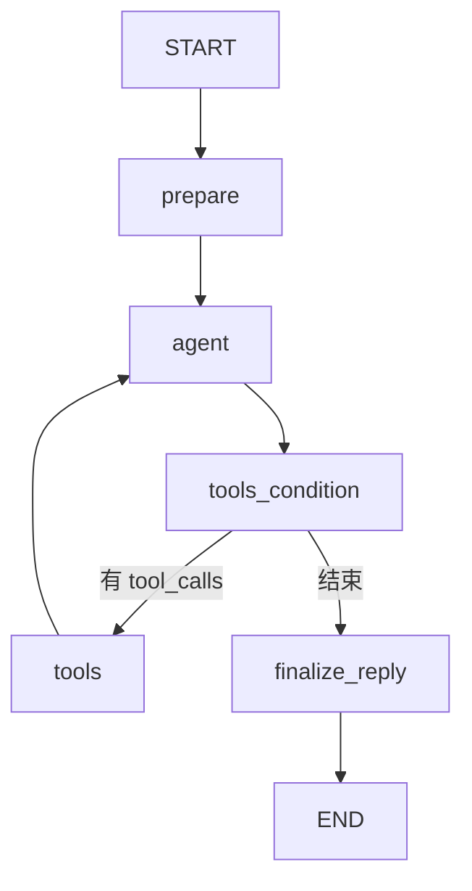
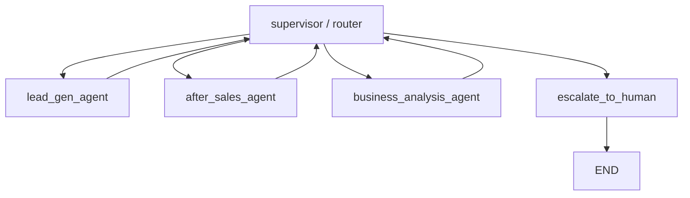

# 上下文控制与 Sub-Agent / Skills 演进方案

> 日期：2026-09-18
> 状态：已确认，暂不实施 sub-agent，先文档化演进路径。

## 1. 当前架构

当前是单一 ReAct agent，不存在 sub-agent，也不存在 agent-as-tool 委托。

工具三个：

- `search_knowledge(query)`：RAG 检索 knowledge
- `record_business_fact(field,value)`：模型主动记录业务画像
- `escalate_to_human(reason)`：转人工

## 2. 三个目录的当前职责

| 目录 | 文件 | 当前使用 | 维护策略 |
|---|---|---|---|
| `knowledge/` | capabilities / scenarios / pricing / implementation / faq | `search_knowledge` 检索 | 保留并持续扩充，新增 .md 后重启自动重索引 |
| `prompts/` | customer_service / follow_up / intent_classifier | 仅 `customer_service.md` 活跃 | 保留活跃 system prompt；其他两个为旧 DAG 残留 |
| `skills/` | lead_gen / after_sales / knowledge_qa / business_analysis | 当前未加载 | 暂不删除，等 sub-agent 引入时复活为子 agent system prompt |

## 3. 为什么引入 Sub-Agent 可以控制上下文

单一 agent 的上下文会随能力增长而膨胀：系统提示词要覆盖获客/售后/评估/知识问答，检索结果也可能带回大量片段。提示词过长会稀释模型注意力。

Sub-agent 模式把域拆分，每个子 agent 只看自己的短 prompt 和窄工具，调用完只返回摘要：

本质是用多轮 LLM 调用换取每轮的上下文精简。

## 4. Skills 的未来定位

引入 sub-agent 后，`skills/` 目录从“对话模板”升级为“子 agent 配置”：

- 每个 `skills/*.md` 对应一个 sub-agent 的 system prompt
- 子 agent 可拥有自己的专属工具（如订单查询、商机分配）
- supervisor 负责路由和结果汇总

## 5. 引入时机

以下信号出现时再引入 sub-agent：

- 系统提示词超过约 2000 字，模型开始忽略后半段
- 不同场景之间回复混乱
- 需要给特定场景绑定专属工具（如订单 API）
- 需要并行执行多个任务

## 6. 实施路径

1. 先让单一 ReAct agent 稳定运行，收集对话日志和用户反馈。
2. 当出现上述信号时，选择真正痛点域拆分。
3. 将 `skills/` 复活为 sub-agent system prompt。
4. 通过 supervisor 做路由，保留 admin 的 intent/scenario/business_profile 可观测性。
